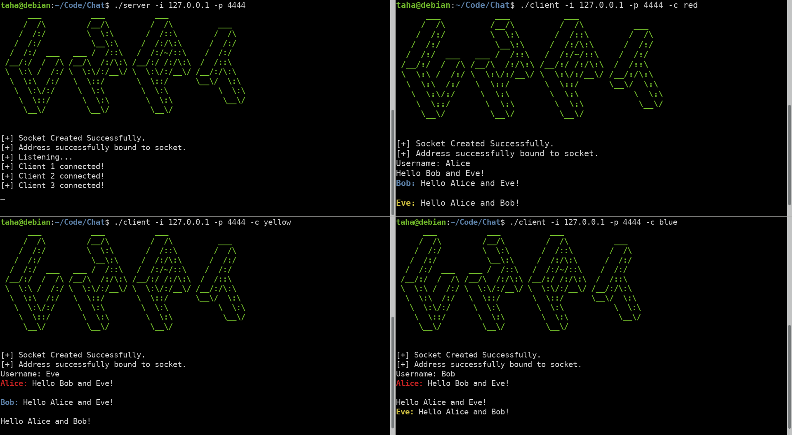

# Chat
 
 A multithreaded chat server that allows for multiple concurrent clients written purely in C using pthreads and sockets.
 
 
 
 ## To Install 
 
 Simply clone this repository and use the provided Makefile to build
 
 ```git clone https://github.com/tazzaoui/Chat.git && cd Chat && make```
 
 ## To Run
 First run the server using the ```server ``` executable, then connect numerous clients by running the ```client``` executable, each of which can be run with the ```-h``` flag for more on their options.

## TODO
<ul>
 <li>Encrypt the TCP stream of messages (OpenSSL)</li>
 <li>Implement functionality for clients to see who's connected to the current chat session</li>
<ul>
